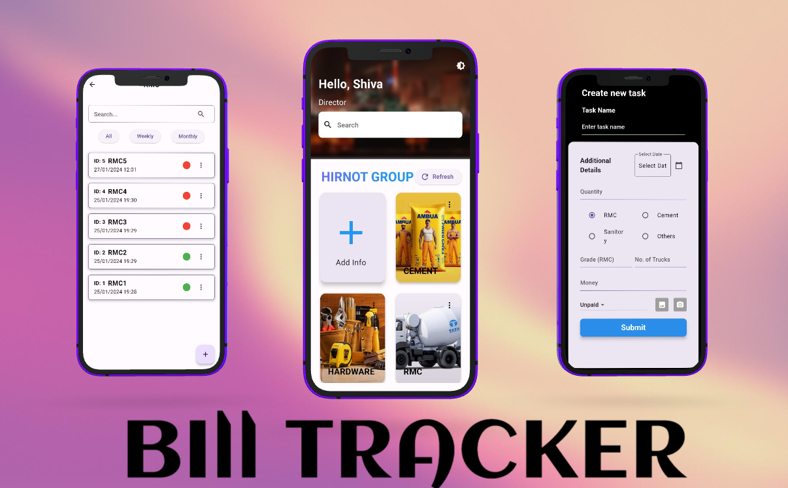
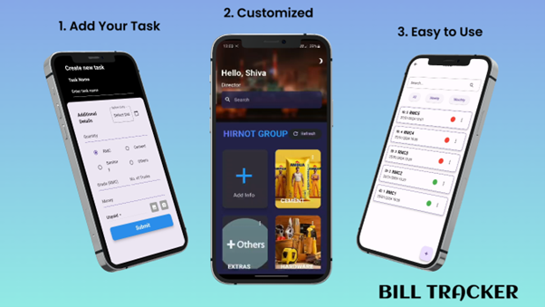

# BillTracker App

## Overview

Welcome to BillTracker, BillTracker is a simple and efficient app designed to help you manage and track your bills effortlessly. With an intuitive interface and powerful features, it is an all-in-one solution for efficiently managing and tracking your bills. This app allows you to store and organize all your bills in one place, keep track of payment status, and Share bill details with your contacts to keep them informed about upcoming due dates, promoting collaborative financial management.


## Features

- **Bill Management:** Easily add, edit, and delete bills with details such as due date, amount, and payment status.
- **Payment Tracking:** Quickly see which bills have been paid, are pending, or are overdue.
- **Comprehensive History:** Access a detailed payment history to track your financial transactions.
- **Categories:** Categorize bills for better organization and easy tracking.
- **Customization:** Personalize the app to suit your preferences with customizable settings.
- **Seamless Bill Sharing:** Share bill details with your contacts to keep them informed about upcoming due dates, promoting collaborative financial management.

## Getting Started

### Prerequisites

- Ensure you have Flutter and Dart installed. Follow the [official Flutter installation guide](https://flutter.dev/docs/get-started/install) for instructions.

## Installation

1. **Clone the repository:**

   ```bash
   git clone https://github.com/kakshaytyagi/BillTracker_Flutter_app


2. **Navigate to the project directory:**
   ```bash
    cd BillTracker_Flutter_app

3. **Install dependencies:**
   ```bash
    flutter pub get


## Screenshots

<div style="display: flex; justify-content: space-between;">
  
</div>

<div style="display: flex; justify-content: space-between;">
  
</div>

<div style="display: flex; justify-content: space-between;">
  
</div>


## Getting Started
1. Clone the repository
2. Open the project in Flutter IDE
3. Run the app on your preferred device or emulator

## Dependencies
- Flutter 2.0 or higher
- Dart 2.12 or higher

## Contributions
Contributions are welcome! If you encounter any issues or have suggestions for improvements, please feel free to open an issue or submit a pull request.

## License
This project is licensed under the developer. Feel free to use and modify the code as per your requirements.

## Acknowledgments
Special thanks to the Flutter community for their valuable resources and inspiration in creating this UI.

- [Lab: Write your first Flutter app](https://docs.flutter.dev/get-started/codelab)
- [Cookbook: Useful Flutter samples](https://docs.flutter.dev/cookbook)

For help getting started with Flutter development, view the
[online documentation](https://docs.flutter.dev/), which offers tutorials,
samples, guidance on mobile development, and a full API reference.


